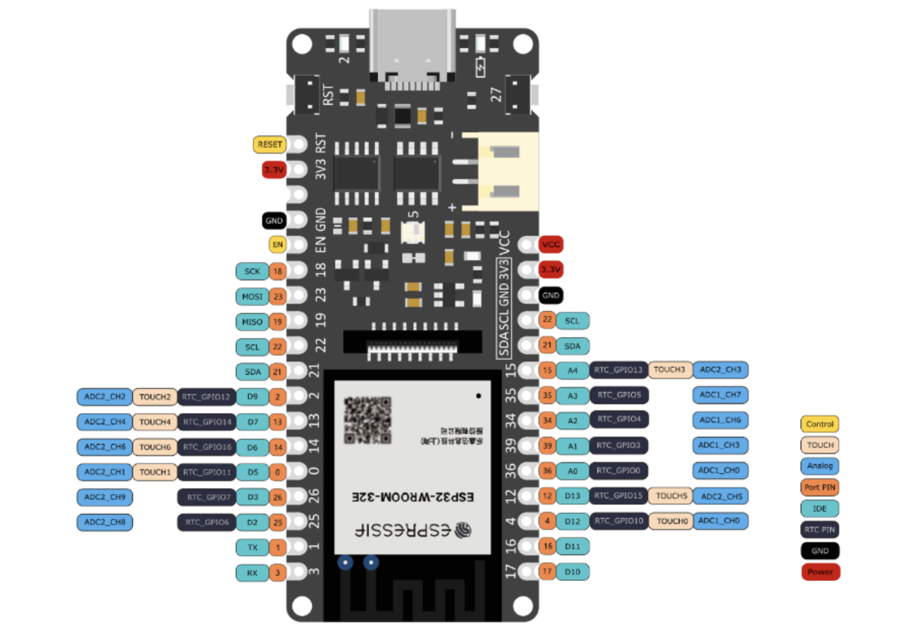
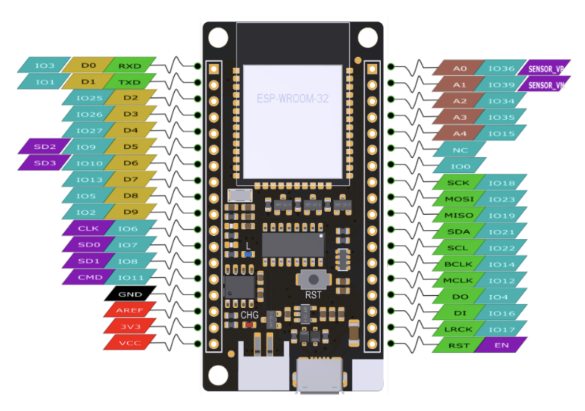
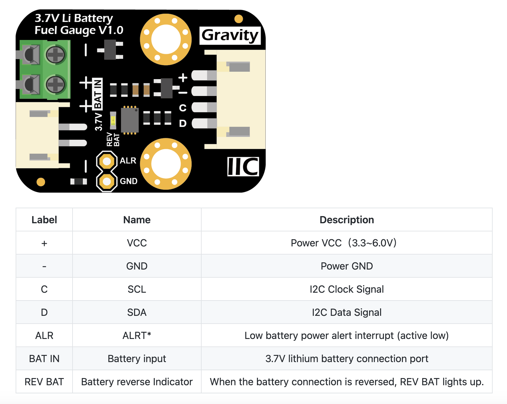

<style>
  body {
    text-align: justify;
    font-size: 12px;
    font-family: Arial, sans-serif;
    color: #000000;
  }

  ul, ol {
    padding-left: 0;  
    margin-left: 0; 
  }

  table {
    font-size: 9px;
    font-family: Arial, sans-serif !important;
    color: #000000;
  }

  #toc {
    position: fixed;
    top: 50px;
    left: 0;
    width: 250px;
    height: auto;
    overflow-y: auto;
  }

  .smaller-space {
    margin-bottom: 5px;  /* Adjust as needed */
  }
</style>

```{r setup, include=FALSE}
knitr::opts_chunk$set(echo = FALSE)

```
# Einleitung ESP32 Micropython

Diese R-Markdown HTML Datei bietet einen simplen Algorithmus, um den Mikrokontroller ESP32 einzurichten und mit einer geeigneten Firmware (z.B. Micropython) zu flashen. Der ESP32 ist ein günstiger und stromsparender Mikrokontroller mit eingebauten Wi-Fi und Bluetooth Funkmodulen. Je nach ESP32 Modell kommen Tensilica- oder RISC-V-Prozessoren zum Einsatz [@abdelmoneim_comparative_2025]. 

**Work flow:** <br>

* Ein Sensor erfasst elektrische Singale und überträgt diese über eine Schnittstelle (I2C) an den ESP23. Mithilfe von Direct Memory Access (DMA) werden die Sensordaten in den flüchtigen Arbeitsspeicher (RAM) geschrieben.

* Die PRO_CPU (eine der beiden Kerne des ESP32) liest die Daten aus dem RAM, verarbeitet sie und bereitet sie für die Übertragung vor. Die APP_CPU übernimmt parallel die Verwaltung des Netzwerkstacks und sendet die aufbereiteten Daten über Wi-Fi weiter.

* Der Code des Systems befindet sich im nicht-flüchtigen, externen Flash-Speicher. Beim Bootprozess wird gespeicherter Code über einen Cache geladen, der Zugriffe beschleunigt und die Systemleistung erhöht. 

* Während flüchtige Daten wie Sensormesswerte im RAM abgelegt werden, verbleiben nicht-flüchtige Daten wie der Programmcode dauerhaft im externen Flash.


```{r fig1, echo=FALSE, fig.align='center', out.width='50%', fig.cap="Abbildung 1: Systemstruktur ESP32 Prozessor [@wijaya_internet_2022]"}
knitr::include_graphics("images/esp32-system-structure.png")


```

```{r, message=FALSE, warning=FALSE}


```

```{r klippy, echo=FALSE, include=TRUE}
klippy::klippy(c('r', 'python'), color = "darkred", tooltip_message = "Click to copy", tooltip_success = "Done!")
```

# Thonny IDE

Eine IDE (Integrated Development Environment) ist eine Software-Anwendung, die alle wichtigen Werkzeuge zum Schreiben, Testen und Fehlersuchen (Debuggen) von Code an einem Ort bietet.
Beim Programmieren eines ESP32 hilft eine IDE dabei, einen Code einfach auf das Board zu übertragen und direkt zu testen.

**Download Thonny IDE für MAC oder Windows**

[MAC Download](https://github.com/thonny/thonny/releases/download/v4.1.7/thonny-4.1.7.pkg)

[Windows Download](https://github.com/thonny/thonny/releases/download/v4.1.7/thonny-4.1.7.exe)

**Thonny Interpreter**

Damit Thonny mit dem ESP32 (z. B. über Micropython) kommunzieren kann, muss der richtige Code Interpreter gewählt werden. Die einfachste Möglichkeit, die Firmware auf das Board zu flashen, besteht direkt über Thonny.  

&rarr; ESP32 mit dem Computer über USB verbinden <br>
&rarr; Thonny öffnen <br>
&rarr; Extras/Tools <br>
&rarr; Einstellungen <br>
&rarr; Tab Interpreter <br>
&rarr; Interpreter Fenster: Micropython (ESP32) <br>
&rarr; Port oder WebREPL: Automatische Detektion <br>
&rarr; Mit OK bestätigen <br>

**Firmware flash über Thonny (einfache Methode)**

&rarr; Install or update Micropython esptool <br>
&rarr; Target Port <br>
&rarr; Micropython familiy: ESP32 <br>
&rarr; Variant: WROOM <br>
&rarr; Version select

# Firebeetle

Der FireBeetle ESP32 ist ein besonders stromsparendes Board, das speziell für Deep-Sleep-Anwendungen entwickelt wurde und so monatelangen Batteriebetrieb ermöglicht. Der Stromverbrauch liegt bei ca. 6–12 µA im Deep-Sleep-Modus und bei 20–30 µA im aktiven Zustand, ohne WLAN-Verbindung. 

Im Folgenden ist das GPIO-Pinout der FireBeetle ESP32-Versionen 1 (4 MB RAM) und 4 (16 MB RAM) aufgeführt.

## Pinout V1.0

```{r fig2, echo=FALSE, fig.align='center', out.width='50%', fig.cap="Abbildung 2: Systemstruktur Firebeetle V1.0 Pinout ([Produkt Wiki](https://wiki.dfrobot.com/FireBeetle_Board_ESP32_E_SKU_DFR0654))"}




```


## Pinout V4.0

```{r fig3, echo=FALSE, fig.align='center', out.width='50%', fig.cap="Abbildung 3: Systemstruktur Firebeetle V4.0 Pinout ([Produkt Wiki](https://wiki.dfrobot.com/FireBeetle_ESP32_IOT_Microcontroller(V3.0)__Supports_Wi-Fi_%26_Bluetooth__SKU__DFR0478))"}




```

# Library 

Im Falle der MicroPython-Firmware ist eine spezifische Ordnerstruktur erforderlich, damit der Code beim Booten korrekt ausgeführt wird. 
Die Dateien `boot.py` und `main.py` müssen sich im `Root (/)` des Dateisystems befinden. Zusätzlich können eigene Module oder Bibliotheken in einem Unterordner wie `/library` organisiert werden. 
Beim Boot-Prozess wird zunächst die Datei `boot.py` ausgeführt, gefolgt von der Ausführung der `main.py`.

&rarr; Verwende `help()` im Terminal von Thonny für allgemeine Hilfe <br>
&rarr; Gib `help('modules')` im Thonny-Terminal ein, um die internen MicroPython-Module (Firmware) anzuzeigen

## ds3231.py

```{python, eval=FALSE, echo=TRUE}

import time
import machine


_ADDR = const(104)

EVERY_SECOND = 0x0F  # Exported flags
EVERY_MINUTE = 0x0E
EVERY_HOUR = 0x0C
EVERY_DAY = 0x80
EVERY_WEEK = 0x40
EVERY_MONTH = 0

try:
    rtc = machine.RTC()
except:
    print("Warning: machine module does not support the RTC.")
    rtc = None


class Alarm:
    def __init__(self, device, n):
        self._device = device
        self._i2c = device.ds3231
        self.alno = n  # Alarm no.
        self.offs = 7 if self.alno == 1 else 0x0B  # Offset into address map
        self.mask = 0

    def _reg(self, offs : int, buf = bytearray(1)) -> int:  # Read a register
        self._i2c.readfrom_mem_into(_ADDR, offs, buf)
        return buf[0]

    def enable(self, run):
        flags = self._reg(0x0E) | 4  # Disable square wave
        flags = (flags | self.alno) if run else (flags & ~self.alno & 0xFF)
        self._i2c.writeto_mem(_ADDR, 0x0E, flags.to_bytes(1, "little"))

    def __call__(self):  # Return True if alarm is set
        return bool(self._reg(0x0F) & self.alno)

    def clear(self):
        flags = (self._reg(0x0F) & ~self.alno) & 0xFF
        self._i2c.writeto_mem(_ADDR, 0x0F, flags.to_bytes(1, "little"))

    def set(self, when, day=0, hr=0, min=0, sec=0):
        if when not in (0x0F, 0x0E, 0x0C, 0x80, 0x40, 0):
            raise ValueError("Invalid alarm specifier.")
        self.mask = when
        if when == EVERY_WEEK:
            day += 1  # Setting a day of week
        self._device.set_time((0, 0, day, hr, min, sec, 0, 0), self)
        self.enable(True)


class DS3231:
    def __init__(self, i2c):
        self.ds3231 = i2c
        self.alarm1 = Alarm(self, 1)
        self.alarm2 = Alarm(self, 2)
        if _ADDR not in self.ds3231.scan():
            raise RuntimeError(f"DS3231 not found on I2C bus at {_ADDR}")

    def get_time(self, data=bytearray(7)):
        def bcd2dec(bcd):  # Strip MSB
            return ((bcd & 0x70) >> 4) * 10 + (bcd & 0x0F)

        self.ds3231.readfrom_mem_into(_ADDR, 0, data)
        ss, mm, hh, wday, DD, MM, YY = [bcd2dec(x) for x in data]
        YY += 2000
        # Time from DS3231 in time.localtime() format (less yday)
        result = YY, MM, DD, hh, mm, ss, wday - 1, 0
        return result

    # Output time or alarm data to device
    # args: tt A datetime tuple. If absent uses localtime.
    # alarm: An Alarm instance or None if setting time
    def set_time(self, tt=None, alarm=None):
        # Given BCD value return a binary byte. Modifier:
        # Set MSB if any of bit(1..4) or bit 7 set, set b6 if mod[6]
        def gbyte(dec, mod=0):
            tens, units = divmod(dec, 10)
            n = (tens << 4) + units
            n |= 0x80 if mod & 0x0F else mod & 0xC0
            return n.to_bytes(1, "little")

        YY, MM, mday, hh, mm, ss, wday, yday = time.localtime() if tt is None else tt
        mask = 0 if alarm is None else alarm.mask
        offs = 0 if alarm is None else alarm.offs
        if alarm is None or alarm.alno == 1:  # Has a seconds register
            self.ds3231.writeto_mem(_ADDR, offs, gbyte(ss, mask & 1))
            offs += 1
        self.ds3231.writeto_mem(_ADDR, offs, gbyte(mm, mask & 2))
        offs += 1
        self.ds3231.writeto_mem(_ADDR, offs, gbyte(hh, mask & 4))  # Sets to 24hr mode
        offs += 1
        if alarm is not None:  # Setting an alarm - mask holds MS 2 bits
            self.ds3231.writeto_mem(_ADDR, offs, gbyte(mday, mask))
        else:  # Setting time
            self.ds3231.writeto_mem(_ADDR, offs, gbyte(wday + 1))  # 1 == Monday, 7 == Sunday
            offs += 1
            self.ds3231.writeto_mem(_ADDR, offs, gbyte(mday))  # Day of month
            offs += 1
            self.ds3231.writeto_mem(_ADDR, offs, gbyte(MM, 0x80))  # Century bit (>Y2K)
            offs += 1
            self.ds3231.writeto_mem(_ADDR, offs, gbyte(YY - 2000))

    def temperature(self):
        def twos_complement(input_value: int, num_bits: int) -> int:
            mask = 2 ** (num_bits - 1)
            return -(input_value & mask) + (input_value & ~mask)

        t = self.ds3231.readfrom_mem(_ADDR, 0x11, 2)
        i = t[0] << 8 | t[1]
        return twos_complement(i >> 6, 10) * 0.25

    def __str__(self, buf=bytearray(0x13)):  # Debug dump of device registers
        self.ds3231.readfrom_mem_into(_ADDR, 0, buf)
        s = ""
        for n, v in enumerate(buf):
            s = f"{s}0x{n:02x} 0x{v:02x} {v >> 4:04b} {v & 0xF :04b}\n"
            if not (n + 1) % 4:
                s = f"{s}\n"
        return s


```
### MIT License clock

```{engine=python, eval=FALSE}

Github_link = https://github.com/peterhinch/micropython-samples/tree/master/DS3231

MIT License

Copyright (c) 2023 Peter Hinch

Permission is hereby granted, free of charge, to any person obtaining a copy
of this software and associated documentation files (the "Software"), to deal
in the Software without restriction, including without limitation the rights
to use, copy, modify, merge, publish, distribute, sublicense, and/or sell
copies of the Software, and to permit persons to whom the Software is
furnished to do so, subject to the following conditions:

The above copyright notice and this permission notice shall be included in all
copies or substantial portions of the Software.

THE SOFTWARE IS PROVIDED "AS IS", WITHOUT WARRANTY OF ANY KIND, EXPRESS OR
IMPLIED, INCLUDING BUT NOT LIMITED TO THE WARRANTIES OF MERCHANTABILITY,
FITNESS FOR A PARTICULAR PURPOSE AND NONINFRINGEMENT. IN NO EVENT SHALL THE
AUTHORS OR COPYRIGHT HOLDERS BE LIABLE FOR ANY CLAIM, DAMAGES OR OTHER
LIABILITY, WHETHER IN AN ACTION OF CONTRACT, TORT OR OTHERWISE, ARISING FROM,
OUT OF OR IN CONNECTION WITH THE SOFTWARE OR THE USE OR OTHER DEALINGS IN THE
SOFTWARE.


```
## sh1107.py

```{python, eval=FALSE, echo=TRUE}
# MicroPython SH1107 OLED driver, I2C interfaces

__version__ = "v319"
__repo__ = "https://github.com/peter-l5/SH1107"

# Sample code sections for RaspberryPi Pico pin assignments
# ------------ SPI ------------------
# Pin Map SPI
#   - 3v3 - xxxxxx   - Vcc
#   - G   - xxxxxx   - Gnd
#   - D7  - GPIO 15  - TX / MOSI fixed
#   - D5  - GPIO 14  - SCK / Sck fixed
#   - D8  - GPIO 13  - CS (optional, if the only connected device)
#   - D2  - GPIO 21  - DC [Data/Command]
#   - D1  - GPIO 20  - Res [reset]
#
# spi1 = SPI(1, baudrate=10_000_000, sck=Pin(14), mosi=Pin(15), miso=Pin(12))
# display = sh1107.SH1107_SPI(128, 128, spi1, Pin(21), Pin(20), Pin(13))
# display.sleep(False)
# display.fill(0)
# display.text('SH1107', 0, 0, 1)
# display.text('driver', 0, 8, 1)
# display.show()
#
# --------------- I2C ------------------
#
# reset PIN is not needed in some implementations
# Pin Map I2C
#   - 3v3 - xxxxxx   - Vcc
#   - G   - xxxxxx   - Gnd
#   - D2  - GPIO 5   - SCK / SCL
#   - D1  - GPIO 4   - DIN / SDA
#   - D0  - GPIO 16  - Res
#   - G   - xxxxxx     CS
#   - G  - xxxxxx     D/C
#
# using hardware I2C

# from machine import Pin, I2C
# import sh1107
# 
# i2c0 = I2C(0, scl=Pin(5), sda=Pin(4), freq=400000)
# display = sh1107.SH1107_I2C(128, 128, i2c0, address=0x3d, rotate=90)
# display.sleep(False)
# display.fill(0)
# display.text('SH1107', 0, 0, 1)
# display.text('driver', 0, 8, 1)
# display.show()

__version__ = "v317"
__repo__ = "https://github.com/peter-l5/SH1107"

## SH1107 module code
from micropython import const
import time
# import extended framebuffer if available)
try:
    import framebuf2 as framebuf
    _fb_variant = 2
except:
    import framebuf
    _fb_variant = 1
print("SH1107: framebuf is ", ("standard" if _fb_variant ==1 else "extended") )

# a few register definitions with SH1107 data sheet reference numbers
_LOW_COLUMN_ADDRESS      = const(0x00)   # 1. Set Column Address 4 lower bits (POR = 00H) 
_HIGH_COLUMN_ADDRESS     = const(0x10)   # 2. Set Column Address 4 higher bits (POR = 10H)  
_MEM_ADDRESSING_MODE     = const(0x20)   # 3. Set Memory addressing mode
                                         #    0x20 horizontal addressing; 0x21 vertical addressing
_SET_CONTRAST            = const(0x8100) # 4. Set Contrast Control (double byte command)
_SET_SEGMENT_REMAP       = const(0xa0)   # 5. Set Segment Re-map: (A0H - A1H)
_SET_MULTIPLEX_RATIO     = const(0xA800) # 6. Set Multiplex Ratio: (Double Bytes Command)
                                         #    duty = 1/64 [3f]  or 128 [7f] (POR)
_SET_NORMAL_INVERSE      = const(0xa6)   # 8. Set Normal/Reverse Display: (A6H -A7H)
_SET_DISPLAY_OFFSET      = const(0xD300) # 9. Set Display Offset: (Double Bytes Command)
                                         #    second byte may need amending for some displays
                                         #    some 128x64 displays (eg Adafruit feather wing 4650)
                                         #    require 0xD360
_SET_DC_DC_CONVERTER_SF  = const(0xad81) # 10. Set DC-DC Setting (set charge pump enable)
                                         #     Set DC-DC enable (a=0:disable; a=1:enable)
                                         #     0xad81 is POR value and may be needed for 128x64 displays 
_SET_DISPLAY_OFF         = const(0xae)   # 11. Display OFF/ON: (AEH - AFH)
_SET_DISPLAY_ON          = const(0xaf)   # 11. Display OFF/ON: (AEH - AFH)
_SET_PAGE_ADDRESS        = const(0xB0)   # 12. Set Page Address (using 4 low bits)
_SET_SCAN_DIRECTION      = const(0xC0)   # 13. Set Common Output Scan Direction: (C0H - C8H)
_SET_DISP_CLK_DIV        = const(0xD550) # 14. Set the frequency of the internal display clocks (DCLKs).
                                         #     0x50 is the POR value
_SET_DIS_PRECHARGE       = const(0xD922) # 15. Set the duration of the pre-charge period. The interval is counted in number of DCLK
                                         #     0x22 is default POR value 
_SET_VCOM_DSEL_LEVEL     = const(0xDB35) # 16. This command is to set the common pad output voltage level at deselect stage.
                                         #     POR value 0x35 (0.77 * Vref) 
_SET_DISPLAY_START_LINE  = const(0xDC00) # 17. Set Display Start Line (double byte command)


class SH1107(framebuf.FrameBuffer):

    def __init__(self, width, height, external_vcc, delay_ms=200, rotate=0):
        self.width = width
        self.height = height
        self.external_vcc = external_vcc
        self.delay_ms = delay_ms
        self.flip_flag = False 
        self.rotate90 = rotate == 90 or rotate == 270
        self.rotate = rotate
        self.inverse = False
        if self.rotate90:
            self.width, self.height = self.height, self.width
        self.pages = self.height // 8
        self.row_width = self.width // 8
        self.bufsize = self.pages * self.width
        self.displaybuf = bytearray(self.bufsize)
        self.displaybuf_mv = memoryview(self.displaybuf)
        self.pages_to_update = 0
        self._is_awake = False
        if self.rotate90:
            super().__init__(self.displaybuf, self.width, self.height,
                             framebuf.MONO_VLSB)
        else:
            super().__init__(self.displaybuf, self.width, self.height, 
                             framebuf.MONO_HMSB)
        self.init_display()

    def init_display(self):
        multiplex_ratio = 0x7F if (self.height == 128)  else 0x3F
        self.reset()
        self.poweroff()
        self.fill(0)
        self.write_command((_SET_MULTIPLEX_RATIO | multiplex_ratio).to_bytes(2,"big"))
        self.write_command((_MEM_ADDRESSING_MODE | (0x00 if self.rotate90 else 0x01)).to_bytes(1,"big"))
        self.write_command(_SET_PAGE_ADDRESS.to_bytes(1,"big")) # set page address to zero        
        self.write_command(_SET_DC_DC_CONVERTER_SF.to_bytes(2,"big"))
        self.write_command(_SET_DISP_CLK_DIV.to_bytes(2,"big"))
        self.write_command(_SET_VCOM_DSEL_LEVEL.to_bytes(2,"big"))
        self.write_command(_SET_DIS_PRECHARGE.to_bytes(2,"big"))
        self.contrast(0)
        self.invert(0)
        # requires a call to flip() for setting up
        self.flip(self.flip_flag)
        self.poweron()

    def poweron(self):
        self.write_command(_SET_DISPLAY_ON.to_bytes(1,"big"))
        self._is_awake = True
        time.sleep_ms(self.delay_ms) # SH1107 datasheet recommends a delay in power on sequence
        
    def poweroff(self):
        self.write_command(_SET_DISPLAY_OFF.to_bytes(1,"big"))
        self._is_awake = False

    def sleep(self, value=True):
        if value == True:
            self.poweroff()
        else:
            self.poweron()
    
    @property
    def is_awake(self) -> bool:
        return self._is_awake

    def flip(self, flag=None, update=True):
        if flag is None:
            flag = not self.flip_flag
        if self.height == 128 and self.width == 128:
            row_offset = 0x00
        elif self.rotate90:
            row_offset = 0x60
        else:
            row_offset = 0x20 if (self.rotate == 180) ^ flag else 0x60
        remap = 0x00 if (self.rotate in (90, 180)) ^ flag else 0x01 
        direction = 0x08 if (self.rotate in (180, 270)) ^ flag else 0x00
        self.write_command((_SET_DISPLAY_OFFSET | row_offset).to_bytes(2,"big"))
        self.write_command((_SET_SEGMENT_REMAP  | remap ).to_bytes(1,"big") )
        self.write_command((_SET_SCAN_DIRECTION | direction ).to_bytes(1,"big") )
        self.flip_flag = flag
        if update:
            self.show(True) # full update

    def display_start_line(self, value):
        """
        17. Set Display Start Line:(Double Bytes Command)
        valid values are 0 (Power on /Reset) to 127 (x00-x7F)
        """
        self.write_command((_SET_DISPLAY_START_LINE | (value & 0x7F)).to_bytes(2,"big"))
        
    def contrast(self, contrast):
        """
        4. contrast can be between 0 (low), 0x80 (POR) and 0xff (high)
        the segment current increases with higher values
        """
        self.write_command((_SET_CONTRAST | (contrast & 0xFF)).to_bytes(2,"big"))

    def invert(self, invert=None):
        if invert == None:
            invert = not self.inverse
        self.write_command((_SET_NORMAL_INVERSE | (invert & 1)).to_bytes(1,"big"))
        self.inverse = invert

    def show(self, full_update: bool = False):
#         _start = time.ticks_us()
        (w, p, db_mv) = (self.width, self.pages, self.displaybuf_mv)
        current_page = 1
        if full_update:
            pages_to_update = (1 << p) - 1
        else:
            pages_to_update = self.pages_to_update
        if self.rotate90:
            buffer_3Bytes = bytearray(3)
            buffer_3Bytes[1] = _LOW_COLUMN_ADDRESS
            buffer_3Bytes[2] = _HIGH_COLUMN_ADDRESS
            for page in range(p):
                if pages_to_update & current_page:
                    buffer_3Bytes[0] = _SET_PAGE_ADDRESS | page
                    self.write_command(buffer_3Bytes)
                    page_start = w * page
                    self.write_data(db_mv[page_start : page_start + w])
                current_page <<= 1
        else:
            row_bytes = w // 8
            buffer_2Bytes = bytearray(2)
            for start_row in range(0, p * 8, 8):
                if pages_to_update & current_page:
                    for row in range(start_row, start_row + 8):
                        buffer_2Bytes[0] = row & 0x0f  # low column (low col. cmd is 0x00)
                        buffer_2Bytes[1] = _HIGH_COLUMN_ADDRESS | (row >> 4) 
                        self.write_command(buffer_2Bytes)
                        slice_start = row * row_bytes
                        self.write_data(db_mv[slice_start : slice_start + row_bytes])
                current_page <<= 1
        self.pages_to_update = 0
#         print("screen update used ", (time.ticks_us() - _start) / 1000, "ms")

    def pixel(self, x, y, c=None):
        if c is None:
            return super().pixel(x, y)
        else:
            super().pixel(x, y , c)
            page = y // 8
            self.pages_to_update |= 1 << page

    def text(self, text, x, y, c=1):
        super().text(text, x, y, c)
        self.register_updates(y, y + 7)

    def line(self, x0, y0, x1, y1, c):
        super().line(x0, y0, x1, y1, c)
        self.register_updates(y0, y1)

    def hline(self, x, y, w, c):
        super().hline(x, y, w, c)
        self.register_updates(y)

    def vline(self, x, y, h, c):
        super().vline(x, y, h, c)
        self.register_updates(y, y + h - 1)

    def fill(self, c):
        super().fill(c)
        self.pages_to_update = (1 << self.pages) - 1

    def blit(self, fbuf, x, y, key=-1, palette=None):
        super().blit(fbuf, x, y, key, palette)
        self.register_updates(y, y + self.height)

    def scroll(self, x, y):
        # my understanding is that scroll() does a full screen change
        super().scroll(x, y)
        self.pages_to_update = (1 << self.pages) - 1

    # rect() and fill_rect() amended to be compatible with new rect() method
    # from latest micropython as well as 1.20.0 and previous versions
    def fill_rect(self, x, y, w, h, c):
        try:
            super().fill_rect(x, y, w, h, c)
        except:
            super().rect(x, y, w, h, c, f=True)
        self.register_updates(y, y + h - 1)

    def rect(self, x, y, w, h, c, f=None):
        if f == None or f == False:
            super().rect(x, y, w, h, c)
        else:
            try:
                super().rect(x, y, w, h, c, f)
            except:
                super().fill_rect(x, y, w, h, c)
        self.register_updates(y, y + h - 1)
    
    def ellipse(self, x, y, xr, yr, c, *args, **kwargs):
        super().ellipse(x, y, xr, yr, c, *args, **kwargs)
        self.register_updates(y - yr, y + yr)

    def poly(self, *args, **kwargs):
        super().poly(*args, **kwargs)
        self.pages_to_update = (1 << self.pages) - 1

    # conditionally define optimisations for framebuf extension if loaded
    if _fb_variant == 2:
        def large_text(self, s, x, y, m, c=1, r=0, *args, **kwargs):
            try:
                super().large_text(s, x, y, m, c, r, *args, **kwargs)
            except:
                raise Exception("extended framebuffer v206+ required")
            h = (8 * m) * (1 if r is None or r % 360 // 90 in (0, 2) else len(s))
            self.register_updates(y, y + h - 1)

        def circle(self, x, y, radius, c, f:bool = None):
            super().circle(x, y, radius, c, f)
            self.register_updates(y-radius, y+radius)
        
        def triangle(self, x0, y0, x1, y1, x2, y2, c, f: bool = None):
            super().triangle(x0, y0, x1, y1, x2, y2, c, f)
            self.register_updates(min(y0, y1, y2), max(y0, y1, y2))

    def register_updates(self, y0, y1=None):
        y1 = min((y1 if y1 is not None else y0), self.height - 1)
        # this function takes the top and optional bottom address of the changes made
        # and updates the pages_to_change list with any changed pages
        # that are not yet on the list
        start_page = y0 // 8
        end_page = (y1 // 8) if (y1 is not None) else start_page
        # rearrange start_page and end_page if coordinates were given from bottom to top
        if start_page > end_page:
            start_page, end_page = end_page, start_page
        # ensure that start and end page values for update are non-negative (-ve is off-screen)
        if end_page >= 0:
            if start_page < 0:
                start_page = 0
            for page in range(start_page, end_page + 1):
                self.pages_to_update |= 1 << page

    def reset(self, res):
        if res is not None:
            res(1)
            time.sleep_ms(1)   # sleep for  1 millisecond
            res(0)
            time.sleep_ms(20)  # sleep for 20 milliseconds
            res(1)
            time.sleep_ms(20)  # sleep for 20 milliseconds

class SH1107_I2C(SH1107):
    def __init__(self, width, height, i2c, res=None, address=0x3d,
                 rotate=0, external_vcc=False, delay_ms=200):
        self.i2c = i2c
        self.address = address
        self.res = res
        if res is not None:
            res.init(res.OUT, value=1)
        super().__init__(width, height, external_vcc, delay_ms, rotate)

    def write_command(self, command_list):
        self.i2c.writeto(self.address, b"\x00" + command_list)

    def write_data(self, buf):
        self.i2c.writevto(self.address, (b"\x40", buf))

    def reset(self):
        super().reset(self.res)

class SH1107_SPI(SH1107):
    def __init__(self, width, height, spi, dc, res=None, cs=None,
                 rotate=0, external_vcc=False, delay_ms=0):
        dc.init(dc.OUT, value=0)
        if res is not None:
            res.init(res.OUT, value=0)
        if cs is not None:
            cs.init(cs.OUT, value=1)
        self.spi = spi
        self.dc = dc
        self.res = res
        self.cs = cs
        super().__init__(width, height, external_vcc, delay_ms, rotate)

    def write_command(self, cmd):
        if self.cs is not None:
            self.cs(1)
            self.dc(0)
            self.cs(0)
            self.spi.write(cmd)
            self.cs(1)
        else:
            self.dc(0)
            self.spi.write(cmd)

    def write_data(self, buf):
        if self.cs is not None:
            self.cs(1)
            self.dc(1)
            self.cs(0)
            self.spi.write(buf)
            self.cs(1)
        else:
            self.dc(1)
            self.spi.write(buf)

    def reset(self):
        super().reset(self.res)
```

### MIT License display

```{engine=python, eval=FALSE}
# The MIT License (MIT)
#
# Copyright (c) 2016 Radomir Dopieralski (@deshipu),
#               2017-2021 Robert Hammelrath (@robert-hh)
#               2021 Tim Weber (@scy)
#               2022-2023 Peter Lumb (peter-l5)
#
# Permission is hereby granted, free of charge, to any person obtaining a copy
# of this software and associated documentation files (the "Software"), to deal
# in the Software without restriction, including without limitation the rights
# to use, copy, modify, merge, publish, distribute, sublicense, and/or sell
# copies of the Software, and to permit persons to whom the Software is
# furnished to do so, subject to the following conditions:
#
# The above copyright notice and this permission notice shall be included in
# all copies or substantial portions of the Software.
#
# THE SOFTWARE IS PROVIDED "AS IS", WITHOUT WARRANTY OF ANY KIND, EXPRESS OR
# IMPLIED, INCLUDING BUT NOT LIMITED TO THE WARRANTIES OF MERCHANTABILITY,
# FITNESS FOR A PARTICULAR PURPOSE AND NONINFRINGEMENT. IN NO EVENT SHALL THE
# AUTHORS OR COPYRIGHT HOLDERS BE LIABLE FOR ANY CLAIM, DAMAGES OR OTHER
# LIABILITY, WHETHER IN AN ACTION OF CONTRACT, TORT OR OTHERWISE, ARISING FROM,
# OUT OF OR IN CONNECTION WITH THE SOFTWARE OR THE USE OR OTHER DEALINGS IN
# THE SOFTWARE.
```

## sht30.py

```{python, eval=FALSE, echo=TRUE}
import time

# I2C address B 0x44 ADDR (pin 2) connected to GND
DEFAULT_I2C_ADDRESS = 0x44

class SHT30:
    """
    SHT30 sensor driver in pure python based on I2C bus

    References:
    * https://www.sensirion.com/fileadmin/user_upload/customers/sensirion/Dokumente/2_Humidity_Sensors/Sensirion_Humidity_Sensors_SHT3x_Datasheet_digital.pdf  # NOQA
    * https://www.wemos.cc/sites/default/files/2016-11/SHT30-DIS_datasheet.pdf
    * https://github.com/wemos/WEMOS_SHT3x_Arduino_Library
    * https://www.sensirion.com/fileadmin/user_upload/customers/sensirion/Dokumente/11_Sample_Codes_Software/Humidity_Sensors/Sensirion_Humidity_Sensors_SHT3x_Sample_Code_V2.pdf
    """
    POLYNOMIAL = 0x131  # P(x) = x^8 + x^5 + x^4 + 1 = 100110001

    ALERT_PENDING_MASK = 0x8000     # 15
    HEATER_MASK = 0x2000            # 13
    RH_ALERT_MASK = 0x0800          # 11
    T_ALERT_MASK = 0x0400           # 10
    RESET_MASK = 0x0010             # 4
    CMD_STATUS_MASK = 0x0002        # 1
    WRITE_STATUS_MASK = 0x0001      # 0

    # MSB = 0x2C LSB = 0x06 Repeatability = High, Clock stretching = enabled
    MEASURE_CMD = b'\x2C\x10'
    STATUS_CMD = b'\xF3\x2D'
    RESET_CMD = b'\x30\xA2'
    CLEAR_STATUS_CMD = b'\x30\x41'
    ENABLE_HEATER_CMD = b'\x30\x6D'
    DISABLE_HEATER_CMD = b'\x30\x66'

    def __init__(self, i2c=None, delta_temp=0, delta_hum=0, i2c_address=DEFAULT_I2C_ADDRESS):
        if i2c is None:
            raise ValueError('An I2C object is required.')
        self.i2c = i2c
        self.i2c_addr = i2c_address
        self.set_delta(delta_temp, delta_hum)
        time.sleep_ms(50)

    def is_present(self):
        """
        Return true if the sensor is correctly conneced, False otherwise
        """
        return self.i2c_addr in self.i2c.scan()

    def set_delta(self, delta_temp=0, delta_hum=0):
        """
        Apply a delta value on the future measurements of temperature and/or humidity
        The units are Celsius for temperature and percent for humidity (can be negative values)
        """
        self.delta_temp = delta_temp
        self.delta_hum = delta_hum

    def _check_crc(self, data):
        # calculates 8-Bit checksum with given polynomial
        crc = 0xFF

        for b in data[:-1]:
            crc ^= b
            for _ in range(8, 0, -1):
                if crc & 0x80:
                    crc = (crc << 1) ^ SHT30.POLYNOMIAL
                else:
                    crc <<= 1
        crc_to_check = data[-1]
        return crc_to_check == crc

    def send_cmd(self, cmd_request, response_size=6, read_delay_ms=100):
        """
        Send a command to the sensor and read (optionally) the response
        The responsed data is validated by CRC
        """
        try:
            self.i2c.writeto(self.i2c_addr, cmd_request)
            if not response_size:
                return
            time.sleep_ms(read_delay_ms)
            data = self.i2c.readfrom(self.i2c_addr, response_size)

            for i in range(response_size//3):
                if not self._check_crc(data[i*3:(i+1)*3]):  # pos 2 and 5 are CRC
                    raise SHT30Error(SHT30Error.CRC_ERROR)
            if data == bytearray(response_size):
                raise SHT30Error(SHT30Error.DATA_ERROR)
            return data
        except OSError:
            raise SHT30Error(SHT30Error.BUS_ERROR)
        except Exception as ex:
            raise ex

    def clear_status(self):
        """
        Clear the status register
        """
        return self.send_cmd(SHT30.CLEAR_STATUS_CMD, None)

    def reset(self):
        """
        Send a soft-reset to the sensor
        """
        return self.send_cmd(SHT30.RESET_CMD, None)

    def status(self, raw=False):
        """
        Get the sensor status register.
        It returns a int value or the bytearray(3) if raw==True
        """
        data = self.send_cmd(SHT30.STATUS_CMD, 3, read_delay_ms=20)

        if raw:
            return data

        status_register = data[0] << 8 | data[1]
        return status_register

    def measure(self, raw=False):
        """
        If raw==True returns a bytearrya(6) with sensor direct measurement otherwise
        It gets the temperature (T) and humidity (RH) measurement and return them.

        The units are Celsius and percent
        """
        data = self.send_cmd(SHT30.MEASURE_CMD, 6)

        if raw:
            return data

        t_celsius = (((data[0] << 8 |  data[1]) * 175) / 0xFFFF) - 45 + self.delta_temp
        rh = (((data[3] << 8 | data[4]) * 100.0) / 0xFFFF) + self.delta_hum
        return t_celsius, rh

    def measure_int(self, raw=False):
        """
        Get the temperature (T) and humidity (RH) measurement using integers.
        If raw==True returns a bytearrya(6) with sensor direct measurement otherwise
        It returns a tuple with 4 values: T integer, T decimal, H integer, H decimal
        For instance to return T=24.0512 and RH= 34.662 This method will return
        (24, 5, 34, 66) Only 2 decimal digits are returned, .05 becomes 5
        Delta values are not applied in this method
        The units are Celsius and percent.
        """
        data = self.send_cmd(SHT30.MEASURE_CMD, 6)
        if raw:
            return data
        aux = (data[0] << 8 | data[1]) * 175
        t_int = (aux // 0xffff) - 45
        t_dec = (aux % 0xffff * 100) // 0xffff
        aux = (data[3] << 8 | data[4]) * 100
        h_int = aux // 0xffff
        h_dec = (aux % 0xffff * 100) // 0xffff
        return t_int, t_dec, h_int, h_dec


class SHT30Error(Exception):
    """
    Custom exception for errors on sensor management
    """
    BUS_ERROR = 0x01
    DATA_ERROR = 0x02
    CRC_ERROR = 0x03

    def __init__(self, error_code=None):
        self.error_code = error_code
        super().__init__(self.get_message())

    def get_message(self):
        if self.error_code == SHT30Error.BUS_ERROR:
            return "Bus error"
        elif self.error_code == SHT30Error.DATA_ERROR:
            return "Data error"
        elif self.error_code == SHT30Error.CRC_ERROR:
            return "CRC error"
        else:
            return "Unknown error"


```

### Apache License 

```{engine=python, eval=FALSE}
Github_link = https://github.com/robert-hh/SHT30

__version__ = '0.2.3'
__author__ = 'Roberto Sánchez'
__license__ = "Apache License 2.0. https://www.apache.org/licenses/LICENSE-2.0"
```

## Soil_moisture

```{python, eval=FALSE, echo=TRUE}
from machine import Pin, ADC

class SoilSensor:
    def __init__(self, pin=36, air_val=3550, water_val=321):
        self.air_val = air_val
        self.water_val = water_val
        self.adc = ADC(Pin(pin))
        self.adc.atten(ADC.ATTN_11DB)
        self.adc.width(ADC.WIDTH_12BIT)
    
    def read(self):
        raw = self.adc.read()
        
        # Constrain value
        if raw > self.air_val:
            raw = self.air_val
        elif raw < self.water_val:
            raw = self.water_val
        
        # Calculate percentage
        percentage = ((self.air_val - raw) / (self.air_val - self.water_val)) * 100
        
        # Get level (DFRobot exact specification)
        # DFRobot: Dry: (air, threshold], Wet: (threshold, threshold], Very Wet: (threshold, water]
        intervals = (self.air_val - self.water_val) // 3
        
        # Calculate thresholds
        dry_threshold = self.air_val - intervals      # 3550 - 1076 = 2474
        wet_threshold = self.water_val + intervals    # 321 + 1076 = 1397
        
        # DFRobot's boundary logic: exclusive lower, inclusive upper
        if raw > dry_threshold:          # > 2474 = Dry
            level = "Dry"
        elif raw > wet_threshold:        # > 1397 (but <= 2474) = Wet
            level = "Wet"
        else:                           # <= 1397 = Very Wet
            level = "Very Wet"
        
        return {
            'raw': raw,
            'voltage': round((raw / 4095) * 3.3, 3),
            'percentage': round(percentage, 1),
            'level': level
        }
    
    def read_list(self):

        data = self.read()  # Get dictionary first
        return [
            data['level'],
            data['raw'], 
            data['percentage'],
            data['voltage']
        ]
    
    def calibrate(self):
        from time import sleep
        
        print("=== Calibration ===")
        print("1. Keep sensor in air, press Enter...")
        input()
        
        air_readings = []
        for i in range(5):
            reading = self.adc.read()
            air_readings.append(reading)
            voltage = round((reading / 4095) * 3.3, 3)
            print(f"Air {i+1}: {reading} (raw) = {voltage}V")
            sleep(1)
        
        air_avg = sum(air_readings) // len(air_readings)
        air_voltage = round((air_avg / 4095) * 3.3, 3)
        print(f"Air average: {air_avg} (raw) = {air_voltage}V")
        
        print("\n2. Put sensor in water, press Enter...")
        input()
        
        water_readings = []
        for i in range(5):
            reading = self.adc.read()
            water_readings.append(reading)
            voltage = round((reading / 4095) * 3.3, 3)
            print(f"Water {i+1}: {reading} (raw) = {voltage}V")
            sleep(1)
        
        water_avg = sum(water_readings) // len(water_readings)
        water_voltage = round((water_avg / 4095) * 3.3, 3)
        print(f"Water average: {water_avg} (raw) = {water_voltage}V")
        
        print(f"\nResults:")
        print(f"Air: {air_avg} raw = {air_voltage}V")
        print(f"Water: {water_avg} raw = {water_voltage}V")
        print(f"Voltage range: {round(air_voltage - water_voltage, 3)}V")
        print(f"\nCode: air_val={air_avg}, water_val={water_avg}")
        
        self.air_val = air_avg
        self.water_val = water_avg
        
        return air_avg, water_avg
```

## MAX17043

```{python, eval=FALSE, echo=TRUE}
import time

from machine import I2C, Pin

## Get I2C bus
i2c = I2C(0, scl = Pin(22), sda = Pin(21))

MAX17043_ADDR = 0x36
MAX17043_VCELL = 0x02
MAX17043_SOC = 0x04
MAX17043_MODE = 0x06
MAX17043_VERSION = 0x08
MAX17043_CONFIG = 0x0c
MAX17043_COMMAND = 0xfe

class DFRobot_MAX17043():
  
  def __init__(self):
    '''!
      @brief create MAX17043 object
      @return MAX17043 object
    '''
    pass
  
  def begin(self):
    '''!
      @brief MAX17043 begin and test moudle
      @return initialization result:
      @retval 0     successful
      @retval -1     faild
    '''
    self._write16(MAX17043_COMMAND, 0x5400)
    time.sleep(0.01)
    if self._read16(MAX17043_CONFIG) == 0x971c:
      self._write16(MAX17043_MODE, 0x4000)
      time.sleep(0.01)
      self._write16(MAX17043_CONFIG, 0x9700)
      return 0
    else:
      return -1
      
  def read_voltage(self):
    '''!
      @brief read battery voltage in mV
      @return voltage in mV
    '''
    return (1.25 * (self._read16(MAX17043_VCELL) >> 4))
  
  def read_percentage(self):
    '''!
      @brief read battery remaining capacity in percentage
      @return battery remaining capacity in percentage
    '''
    tmp = self._read16(MAX17043_SOC)
    return ((tmp >> 8) + 0.003906 * (tmp & 0x00ff))

  def set_Interrupt(self, per):
    '''!
      @brief set MAX17043 interrput threshold
      @param per       interrupt threshold as %1 - 32% (integer)
    '''
    if per > 32:
      per = 32
    elif per < 1:
      per = 1
    per = 32 - int(per)
    self._write_reg_bits(MAX17043_CONFIG, per, 0x01f, 0)

  def clear_interrupt(self):
    '''!
      @brief clear MAX17043 interrupt.
    '''
    self._write_reg_bits(MAX17043_CONFIG, 0, 0x01, 5)
    
  def set_sleep(self):
    '''!
      @brief set MAX17043 in sleep mode.
    '''
    self._write_reg_bits(MAX17043_CONFIG, 1, 0x01, 7)
    
  def set_wakeup(self):
    '''!
      @brief wake up MAX17043.
    '''
    self._write_reg_bits(MAX17043_CONFIG, 0, 0x01, 7)
  
  def _write16(self, reg, dat):
    buf = bytearray(2)
    buf[0] = dat >> 8
    buf[1] = dat & 0x00ff
    i2c.writeto_mem(MAX17043_ADDR, reg, buf)
    
  def _read16(self, reg):
    buf = i2c.readfrom_mem(MAX17043_ADDR, reg, 2)
    return ((buf[0] << 8) | buf[1])
  
  def _write_reg_bits(self, reg, dat, bits, offset):
    tmp = self._read16(reg)
    tmp = (tmp & (~(bits << offset))) | (dat << offset)
    self._write16(reg, tmp)
```

### MIT License fuel gauge

```{engine=python, eval=FALSE}
'''!
  @file DFRobot_MAX17043.py
  @copyright   Copyright (c) 2010 DFRobot Co.Ltd (http://www.dfrobot.com)
  @license     The MIT License (MIT)
  @author [ouki.wang](ouki.wang@dfrobot.com)
  @version  V1.0
  @date  2018-4-14
  @url https://github.com/DFRobot/DFRobot_MAX17043
'''
```

# LED control 

```{python, eval=FALSE, echo=TRUE}
# Root modules
from time import sleep
from machine import Pin, PWM

# LED init
led_pin = Pin(2, Pin.OUT) # LED GIPO board specific 
sleep(0.5)                          # buffer time 
led_pin.off()                       # Power switch on/off
sleep(1)
led_pin.on()
sleep(5)

# Switch to Pulse Width Manipulation (PWM)
pwm = PWM(Pin(2), freq = 1_000)
pwm.duty(512) # 50% power
sleep(5)      # sleep five seconds
pwm.duty(100)
sleep(5)
pwm.deinit() # deinitialization PWM pin

#LED init
led_pin = Pin(2, Pin.OUT)
led_pin.off()
```

# Display control 

```{python, eval=FALSE, echo=TRUE}
# VCC -> 3.3 V Pin
# GND -> GND
# SCL -> 26 
# SDA -> 25

# Root modules
from time import sleep
from machine import I2C, Pin, deepsleep
import os 
import sys

## /library 
sys.path.append('/library') # directory modules (external) not included in micropython
import sh1107
import sht30

# Hardware adress
# sh1107_display = 60
# hexademical = 0x3c

# I2C bus
try:
    i2c_bus_one  = I2C(1, scl=Pin(26), sda=Pin(25)) # use scl(22) and sda(21) with bus 0
except Exception as e:
    print("I2C Init", str(e))

## Scan connected devices 
display_addr = i2c_bus_one.scan()

if display_addr:
    for addr in display_addr: # checks the whole bus tupel
        print(hex(addr))  
else:
    print("I2C Bus 1", "No display found")

# Display init
try:
    display = sh1107.SH1107_I2C(128, 128, i2c_bus_one, address=0x3C, rotate=180) # move between four display sides
    display.sleep(False) # True in case of power saving mode (deepsleep)
    display.fill(0)
    display.text("starting...", 0, 0, 1) # any text can be used 
    display.show()
except Exception as e:
    print("Display", str(e))

# Variables
msg_one = "Hallo!"
msg_two = "Hallo!!"
msg_three = "Hallo!!!"

# simple function
def display_test():
    display.fill(0) # 0 or 1 for colour
    display.text(msg_one, 0, 0, 1) # x-coordinate, y-coordinate, color
    display.text(msg_two, 0, 8, 1)
    display.text(msg_three, 0, 16, 1)
    display.show()
    sleep(5)
    display.fill(0)
    display.show()
    display.sleep(True)
    
display_test()
```

# Temperature and Humidity 

```{python, eval=FALSE, echo=TRUE}
# VCC -> 3.3 V Pin
# GND -> GND
# SCL  -> Pin(22)
# SDA -> Pin(21)
# Adress_hexademical = 0x44
# Adress_demical = 68

# Root modules
from time import sleep
from machine import I2C, Pin, deepsleep
import os 
import sys

## /library 
sys.path.append('/library') # directory modules (external) not included in micropython
import sht30

# I2C bus lane
try:
    i2c_bus_zero = I2C(0, scl=Pin(22), sda=Pin(21)) #sht30
except Exception as e:
    print("I2C_sht30 Init", str(e)) # str = character string
    
## Scan I2C buses
sht30_address = i2c_bus_zero.scan()

if sht30_address:
    for addr in sht30_address:
        print(hex(addr))
else:
    print("I2C Bus 0", "No devices found")

# SHT30 init
try:
    sht = sht30.SHT30(i2c=i2c_bus_zero, i2c_address=68)
except Exception as e:
    print("SHT30", str(e))
    
# simple measurment
sht30_values = sht.measure()
sleep(1)
temperature = round(sht30_values[0], 1)
humidity = round(sht30_values[1],1)
print(f"Temperature {temperature} °C \nHumidity {humidity} %")

# forever loop
while True:
    sht30_values = sht.measure()
    sleep(2)
    temperature = round(sht30_values[0], 1)
    humidity = round(sht30_values[1],1)
    print(f"Temperature {temperature} °C \nHumidity {humidity} %")
    sleep(5)
```

# Abiotic parameters + display

```{python, eval=FALSE, echo=TRUE}
# VCC -> 3.3 V Pin
# GND -> GND
# SCL  -> Pin(22)
# SDA -> Pin(21)

# Root modules
from time import sleep
from machine import I2C, Pin, deepsleep
import os 
import sys

## /library 
sys.path.append('/library') # directory modules (external) not included in micropython
import sh1107
import sht30

# I2C bus lane
try:
    i2c_bus_zero = I2C(0, scl=Pin(22), sda=Pin(21)) #sht30
    i2c_bus_one  = I2C(1, scl=Pin(26), sda=Pin(25)) #display
except Exception as e:
    print("I2C Init", str(e))
    
## Scan I2C buses
sht30_adress = i2c_bus_zero.scan()
display_address = i2c_bus_one.scan()

if not sht30_adress:
    ("I2C Bus 0", "No devices found")
if not display_address:
    print("I2C Bus 1", "No display found")

# Display init
try:
    display = sh1107.SH1107_I2C(128, 128, i2c_bus_one, address=0x3C, rotate=180) # move between four display sides
    display.sleep(False) # True in case of power saving mode (deepsleep)
    display.fill(0)
    display.text("starting...", 0, 0, 1) # any text can be used 
    display.show()
except Exception as e:
    print("Display", str(e))

## Display function
def display_values(temperature, humidity):
    display.fill(0)
    display.text(f"Temp: {temperature}C", 0, 0, 1)
    display.text(f"Hum: {humidity}%", 0, 8, 1)
    display.show()
    
# Sht30 init
try:
    sht = sht30.SHT30(i2c=i2c_bus_zero, i2c_address=68)
except Exception as e:
    print("SHT30", str(e))

# Simple loop with values and screen
while True:
    try:
        sht30_values = sht.measure()
        sleep(2)
        temperature = round(sht30_values[0], 1)
        humidity = round(sht30_values[1],1)
        print(f"Temperature {temperature} °C \nHumidity {humidity} %")
        display_values(temperature, humidity)
    except Exception as error:
        print("Measurment error")
    
    sleep(5)
```

# One wire ds18x20 

```{python, eval=FALSE, echo=TRUE}

#Source = https://docs.micropython.org/en/v1.9.1/esp8266/esp8266/tutorial/onewire.html
import time
import machine
import onewire, ds18x20

# the device is on GPIO12
dat = machine.Pin(12)

# create the onewire object
ds = ds18x20.DS18X20(onewire.OneWire(dat))

# scan for devices on the bus
roms = ds.scan()
print('found devices:', roms)

# loop 10 times and print all temperatures
for i in range(10):
    print('temperatures:', end=' ')
    ds.convert_temp()
    time.sleep_ms(750)
    for rom in roms:
        print(ds.read_temp(rom), end=' ')
    print()
```

# Real time clock (RTC) + deepsleep
Für einen erfolgreichen deeplseep muss die Micropython file als `main.py` Datei abgespeichert werden!

```{python, eval=FALSE, echo=TRUE}
# Library 
from time import sleep
from machine import I2C, Pin, deepsleep
import os 
import sys

sys.path.append('/library')
import sh1107
from ds3231 import DS3231

# I2C adress
## sh1107      = 60
## ds3231      = 104

# Variables
sleep_minute = 1
sleep_buffer = 15

# I2C bus lane
## I2C bus 0 (ds3231)
try:
    i2c_bus_zero = I2C(0, scl=Pin(22), sda=Pin(21))
except Exception as e:
    print("Error init I2C bus 0 (SHT30):", str(e))

## I2C bus 1 (display)
try:
    i2c_bus_one = I2C(1, scl=Pin(26), sda=Pin(25))
except Exception as e:
    print("Error init I2C bus 1 (Display):", str(e))

## Scan I2C buses
sht30_adress = i2c_bus_zero.scan()
sleep(0.5)
print(sht30_adress)
display_address = i2c_bus_one.scan()
sleep(0.5)
print(display_address)

if not sht30_adress:
    print("I2C Bus 0", "No devices found")
if not display_address:
    print("I2C Bus 1", "No display found")

# Display init
try:
    display = sh1107.SH1107_I2C(128, 128, i2c_bus_one, address=0x3C, rotate=180) # move between four display sides
    display.sleep(False) # True in case of power saving mode (deepsleep)
    display.fill(0)
    display.text("starting...", 0, 0, 1) # any text can be used 
    display.show()
except Exception as e:
    print("Display", str(e))

## Display functions
### Disiplay values
def display_values(Date, Time_now):
    display.fill(0)
    display.text(f"Date: {Date}C", 0, 0, 1)
    display.text(f"Time: {Time_now}", 0, 8, 1)
    display.show()

### Display sleep   
def display_sleep():
    display.fill(0) # black screen
    display.text("Sleeping in 15 s...", 0, 0, 1)
    display.text(f"Sleeptime: {sleep_minute} Min", 0, 8, 1)
    display.show()
    sleep(sleep_buffer)
    display.fill(0)
    display.show()
    display.sleep(True)  # Put OLED in low power mode
    
# Clock init
try:
    rtc = DS3231(i2c_bus_zero)
    sleep(1)
except Exception as e:
    print("Clock error", str(e))

## Clock functions
### Read time 
def clock_check():
    current_time = rtc.get_time()
    return current_time

### Set time
def set_rtc_time():
    rtc.set_time((2025, 5, 18, 19, 6, 0, 0, 0))  # YY, MM, mday, hh, mm, ss, wday, yday
    print("RTC time set.")

#set_rtc_time() # uncommand this once
    
# Infinity loop
while True:  
    for i in range(5):
        
        # Get current date and time from RTC
        year, month, day, hour, minute, second, _, _ = clock_check()
        
        #character string date time 
        date = f"{year:04d}-{month:02d}-{day:02d}"
        time_now = f"{hour:02d}:{minute:02d}:{second:02d}"
        sleep(0.5)
  
        # Display values on the OLED
        print(f"Date: {date}\nTime: {time_now}")
        display_values(date, time_now)            
        sleep(10)
    
    print(f"going to deepsleep in {sleep_buffer} seconds")
    display_sleep()
    
    # deepsleep
    deepsleep(60 * sleep_minute * 1000)  # seconds*number minutes*miliseconds 
```

# SDcard
```{python, eval=FALSE, echo=TRUE}
# Library 
from time import sleep
from machine import I2C, Pin, deepsleep, SDCard
import os 
import sys

sys.path.append('/library')
import sh1107
import sht30
from ds3231 import DS3231

# Variables
sleep_minute = 1
sleep_buffer = 15

# LED
led_pin = Pin(2, Pin.OUT)
led_pin.off()

# I2C bus lane
## I2C bus 0 (ds3231, sht30)
try:
    i2c_bus_zero = I2C(0, scl=Pin(22), sda=Pin(21))
except Exception as e:
    print("Error init I2C bus 0 (SHT30):", str(e))

## I2C bus 1 (display)
try:
    i2c_bus_one = I2C(1, scl=Pin(26), sda=Pin(25))
except Exception as e:
    print("Error init I2C bus 1 (Display):", str(e))

## Scan I2C buses
sht30_clock_adress = i2c_bus_zero.scan()
sleep(0.5)
print(sht30_clock_adress)
display_address = i2c_bus_one.scan()
sleep(0.5)
print(display_address)

if not sht30_clock_adress:
    print("I2C Bus 0", "No devices found")
if not display_address:
    print("I2C Bus 1", "No display found")

# Display init
try:
    display = sh1107.SH1107_I2C(128, 128, i2c_bus_one, address=0x3C, rotate=180) # move between four display sides
    display.sleep(False) # True in case of power saving mode (deepsleep)
    display.fill(0)
    display.text("starting...", 0, 0, 1) # any text can be used 
    display.show()
except Exception as e:
    print("Display", str(e))

sleep(0.5)

## Display functions
### Display values
def display_values(date, time_now, temperature, humidity):
    display.fill(0)
    display.text(f"Date: {date}", 0, 0, 1)
    display.text(f"Time: {time_now}", 0, 8, 1)
    display.text(f"Temp: {temperature} C", 0, 16, 1)
    display.text(f"Humi: {humidity} %", 0, 24, 1)
    display.show()

### Display sleep
def display_sleep():
    display.fill(0) # black screen
    display.text("Sleeping in 15 s...", 0, 0, 1)
    display.text(f"Sleeptime: {sleep_minute} Min", 0, 8, 1)
    print("sleeping in 15s")
    print("Sleeptime:", sleep_minute)
    display.show()
    sleep(sleep_buffer)
    display.fill(0)
    display.show()
    display.sleep(True)  # Put OLED in low power mode

### Display sd card free space
def display_storage(sdcard_status):
    display.fill(0)
    display.text(f"SD: {sdcard_status} GB", 0, 0, 1)
    print(sdcard_status, "GB")
    display.show()
    
# Clock init
try:
    rtc = DS3231(i2c_bus_zero)
    sleep(1)
except Exception as e:
    print("Clock error", str(e))

##Clock functions
### Read time 
def clock_check():
    current_time = rtc.get_time()
    return current_time

### Set time 
def set_rtc_time():
    rtc.set_time((2025, 5, 18, 19, 6, 0, 3, 138))  # YY, MM, mday, hh, mm, ss, wday, yday
    print("RTC time set.")

#set_rtc_time() # uncomment for setting the date and time one time

# SDcard init and mount
try:
    sd = SDCard(slot=2, sck=Pin(18), mosi=Pin(23), miso=Pin(19), cs=Pin(4), freq=10_000_000) # _ = point for big numbers 
    os.mount(sd, '/sd')
    print("SD card mounted")
except Exception as e:
    print("SD Card", str(e))

sleep(1)

## SDcard read internal space
def sd_storage():
    try:
        statvfs = os.statvfs('/sd')
        free_space = statvfs[0] * statvfs[3]
        return round(free_space / (1024 ** 3), 2)
    except Exception as e:
        print("SD Storage", str(e))

## Display free space
sdcard_status = sd_storage()
display_storage(sdcard_status)
sleep(1)

# CSV file + path
sd_file = 'data_one.csv'
sd_path = '/sd/' + sd_file

## Create CSV file
if sd_file not in os.listdir('/sd'):
    try:
        with open(sd_path, 'w') as f:
            f.write("Date,Time,Temperature,Humidity\n")
    except Exception as e:
        print("CSV Init", str(e))
else:
    print("CSV file present")

sleep(1)

# SHT30 sensor
try:
    sht = sht30.SHT30(i2c=i2c_bus_zero, i2c_address=68)
except Exception as e:
    print("SHT30", str(e))

# Infinity loop
while True:   
    for i in range(5):
        try:
            year, month, day, hour, minute, second, _, _ = clock_check()
            date = f"{year:04d}-{month:02d}-{day:02d}"
            time_now = f"{hour:02d}:{minute:02d}:{second:02d}"
            abiotic_values = sht.measure()
            temperature = round(abiotic_values[0], 1)
            humidity = round(abiotic_values[1], 1)
            
            print(f"Date:{date}\nTime:{time_now}\nTemperature:{temperature} C\nHumidty:{humidity} %")        
            display_values(date, time_now, temperature, humidity)
            
            with open(sd_path, 'a') as f:
                f.write(f"{date},{time_now},{temperature},{humidity}\n")
        except Exception as e:
            print("Loop", str(e))
        sleep(5)

    try:
        os.umount('/sd')
        print("SD unmounted")
    except Exception as e:
        print("SD Unmount", str(e))

    display.fill(0)
    display.text("SD unmounted", 0, 0, 1)
    display.show()
    sleep(5)
    
    display_sleep()
    
    deepsleep(60 * sleep_minute * 1000)  # 1 minutes
```

# Blackbox error

```{python, eval=FALSE, echo=TRUE}
# Library 
from time import sleep
from machine import I2C, Pin, deepsleep, SDCard
import os 
import sys

sys.path.append('/library')
import sh1107
import sht30
from ds3231 import DS3231

# Variables
sleep_minute = 1
sleep_buffer = 15

# LED
led_pin = Pin(2, Pin.OUT)
led_pin.off()

# Clock power
clock_power = Pin(13, Pin.OUT)
clock_power.on()

# Error function
###### Create /log directory first ######
def handle_error(source="Unknown", message="Error"):
    log_entry = f"[{source}] {message}\n"

    # Write to log/error_log.txt
    try:
        with open("log/error_log.txt", "a") as log_file: 
            log_file.write(log_entry)
    except Exception as e:
        print("Could not write to log file:", e)

    # Display error on OLED (if connected)
    print(log_entry.strip())
    try:
        display.fill(0)
        display.text("Error occurred!", 0, 0, 1)
        display.text(f"{source}:", 0, 16, 1)
        display.text(message[:16], 0, 32, 1)
        display.show()
        sleep(10)
        display.fill(0) 
        display.sleep(True)
    except Exception as e:
        print("Display error:", e)
    
    try:     
        os.listdir('/sd')
        os.umount('/sd')
        print("SDcard unmounted")
    except Exception as e:
        print("SD error", e)

    sleep(5)
    print("Clock power off")
    clock_power.off()
    deepsleep(30 * 1000)  # Sleep for 30 seconds
    
# I2C bus lane
## I2C bus 0 (ds3231, sht30)
try:
    i2c_bus_zero = I2C(0, scl=Pin(22), sda=Pin(21))
except Exception as e:
    handle_error("I2C Init bus 0:", str(e))

## I2C bus 1 (display)
try:
    i2c_bus_one = I2C(1, scl=Pin(26), sda=Pin(25))
except Exception as e:
    handle_error("I2C Init bus 1", str(e))

## Scan I2C buses
sht30_clock_adress = i2c_bus_zero.scan()
sleep(0.5)
print(sht30_clock_adress)
display_address = i2c_bus_one.scan()
sleep(0.5)
print(display_address)

# Display init
try:
    display = sh1107.SH1107_I2C(128, 128, i2c_bus_one, address=0x3C, rotate=180) # move between four display sides
    display.sleep(False) # True in case of power saving mode (deepsleep)
    display.fill(0)
    display.text("starting...", 0, 0, 1) # any text can be used 
    display.show()
except Exception as e:
    handle_error("Display", str(e))

sleep(0.5)

## Display functions
### Display values
def display_values(date, time_now, temperature, humidity):
    display.fill(0)
    display.text(f"Date: {date}", 0, 0, 1)
    display.text(f"Time: {time_now}", 0, 8, 1)
    display.text(f"Temp: {temperature} C", 0, 16, 1)
    display.text(f"Humi: {humidity} %", 0, 24, 1)
    display.show()

### Display sleep
def display_sleep():
    display.fill(0) # black screen
    display.text("Sleeping in 15 s...", 0, 0, 1)
    display.text(f"Sleeptime: {sleep_minute} Min", 0, 8, 1)
    print("sleeping in 15s")
    print("Sleeptime:", sleep_minute)
    display.show()
    sleep(sleep_buffer)
    display.fill(0)
    display.show()
    display.sleep(True)  # Put OLED in low power mode

### Display sd card free space
def display_storage(sdcard_status):
    display.fill(0)
    display.text(f"SD: {sdcard_status} GB", 0, 0, 1)
    print(sdcard_status, "GB")
    display.show()
    
# Clock init
try:
    rtc = DS3231(i2c_bus_zero)
    sleep(1)
except Exception as e:
    handle_error("Clock error", str(e))

##Clock functions
### Read time 
def clock_check():
    current_time = rtc.get_time()
    return current_time

### Set time 
def set_rtc_time():
    rtc.set_time((2025, 5, 18, 19, 6, 0, 3, 138))  # YY, MM, mday, hh, mm, ss, wday, yday
    print("RTC time set.")

#set_rtc_time() # uncomment for setting the date and time one time

# SDcard init and mount
try:
    sd = SDCard(slot=2, sck=Pin(18), mosi=Pin(23), miso=Pin(19), cs=Pin(4), freq=10_000_000) # _ = point for big numbers 
    os.mount(sd, '/sd')
    print("SD card mounted")
except Exception as e:
    handle_error("SD Card init", str(e))

sleep(1)

## SDcard read internal space
def sd_storage():
    try:
        statvfs = os.statvfs('/sd')
        free_space = statvfs[0] * statvfs[3]
        return round(free_space / (1024 ** 3), 2)
    except Exception as e:
        handle_error("SD Storage calc", str(e))

## Display free space
sdcard_status = sd_storage()
display_storage(sdcard_status)
sleep(1)

# CSV file + path
sd_file = 'data_one.csv'
sd_path = '/sd/' + sd_file

## Create CSV file
if sd_file not in os.listdir('/sd'):
    try:
        with open(sd_path, 'w') as f:
            f.write("Date,Time,Temperature,Humidity\n")
    except Exception as e:
        handle_error("CSV first Init", str(e))
else:
    print("CSV file present")

sleep(1)

# SHT30 sensor
try:
    sht = sht30.SHT30(i2c=i2c_bus_zero, i2c_address=68)
except Exception as e:
    handle_error("SHT30 init", str(e))

# Infinity loop
while True:   
    for i in range(5):
        try:
            year, month, day, hour, minute, second, _, _ = clock_check()
            date = f"{year:04d}-{month:02d}-{day:02d}"
            time_now = f"{hour:02d}:{minute:02d}:{second:02d}"
            abiotic_values = sht.measure()
            temperature = round(abiotic_values[0], 1)
            humidity = round(abiotic_values[1], 1)
            
            print(f"Date:{date}\nTime:{time_now}\nTemperature:{temperature} C\nHumidty:{humidity} %")        
            display_values(date, time_now, temperature, humidity)
            
            with open(sd_path, 'a') as f:
                f.write(f"{date},{time_now},{temperature},{humidity}\n")
        except Exception as e:
            handle_error("Loop", str(e))
        sleep(5)

    try:
        os.umount('/sd')
        print("SD unmounted")
    except Exception as e:
        handle_error("SD Unmount", str(e))

    display.fill(0)
    display.text("SD unmounted", 0, 0, 1)
    display.show()
    sleep(5)
    
    display_sleep()
    clock_power.off()
    
    deepsleep(60 * sleep_minute * 1000)  # 1 minutes
```

# Battery fuel gauge 

Der DFRobot Fuel Gauge überwacht präzise Spannung und Ladezustand von 3.7V Lithium-Batterien, wobei das vollständige Pinout-Schema in der nachfolgenden Abbildung dargestellt ist. <br>

Der integrierte Maxim-Algorithmus lernt kontinuierlich die spezifischen Batterieeigenschaften und speichert diese Daten intern (volatile), welche bei vollständiger Stromunterbrechung verloren gehen und eine Neukalibrierung erfordern.

```{r fig4, echo=FALSE, fig.align='center', out.width='50%', fig.cap="Abbildung 4: Systemstruktur Fuel gauge V1.0 Pinout ([Produkt Wiki](https://wiki.dfrobot.com/Gravity__3.7V_Li_Battery_Fuel_Gauge_SKU__DFR0563))"}


```

## Fuel gauge code

```{python, eval=FALSE, echo=TRUE}
# Library 
from time import sleep
from machine import I2C, Pin, deepsleep, SDCard
import os 
import sys

sys.path.append('/library')
import sh1107
import sht30
from ds3231 import DS3231
from DFRobot_MAX17043 import DFRobot_MAX17043

# Variables
sleep_minute = 1
sleep_buffer = 15

# LED
led_pin = Pin(2, Pin.OUT)
led_pin.off()

# Clock power
clock_power = Pin(13, Pin.OUT)
clock_power.on()

# Error function
###### Create /log directory first ######
def handle_error(source="Unknown", message="Error"):
    log_entry = f"[{source}] {message}\n"

    # Write to log/error_log.txt
    try:
        with open("log/error_log.txt", "a") as log_file: 
            log_file.write(log_entry)
    except Exception as e:
        print("Could not write to log file:", e)

    # Display error on OLED (if connected)
    print(log_entry.strip())
    try:
        display.fill(0)
        display.text("Error occurred!", 0, 0, 1)
        display.text(f"{source}:", 0, 16, 1)
        display.text(message[:16], 0, 32, 1)
        display.show()
        sleep(10)
        display.fill(0) 
        display.sleep(True)
    except Exception as e:
        print("Display error:", e)
    
    try:     
        os.listdir('/sd')
        os.umount('/sd')
        print("SDcard unmounted")
    except Exception as e:
        print("SD error", e)

    sleep(5)
    print("Clock power off")
    clock_power.off()
    deepsleep(30 * 1000)  # Sleep for 30 seconds
    
# I2C bus lane
## I2C bus 0 (ds3231, sht30)
try:
    i2c_bus_zero = I2C(0, scl=Pin(22), sda=Pin(21))
except Exception as e:
    handle_error("I2C Init bus 0:", str(e))

## I2C bus 1 (display)
try:
    i2c_bus_one = I2C(1, scl=Pin(26), sda=Pin(25))
except Exception as e:
    handle_error("I2C Init bus 1", str(e))

## Scan I2C buses
sht30_clock_adress = i2c_bus_zero.scan()
sleep(0.5)
print(sht30_clock_adress)
display_address = i2c_bus_one.scan()
sleep(0.5)
print(display_address)

# Display init
try:
    display = sh1107.SH1107_I2C(128, 128, i2c_bus_one, address=0x3C, rotate=180) # move between four display sides
    display.sleep(False) # True in case of power saving mode (deepsleep)
    display.fill(0)
    display.text("starting...", 0, 0, 1) # any text can be used 
    display.show()
except Exception as e:
    handle_error("Display", str(e))

sleep(0.5)

## Display functions
### Display values
def display_values(date, time_now, temperature, humidity, voltage, percentage):
    display.fill(0)
    display.text(f"Date: {date}", 0, 0, 1)
    display.text(f"Time: {time_now}", 0, 8, 1)
    display.text(f"Temp: {temperature} C", 0, 16, 1)
    display.text(f"Humi: {humidity} %", 0, 24, 1)
    display.text(f"Volt: {voltage} V", 0, 32, 1)
    display.text(f"Batt: {percentage} %", 0, 40, 1)
    display.show()

### Display sleep
def display_sleep():
    display.fill(0) # black screen
    display.text("Sleeping in 15 s...", 0, 0, 1)
    display.text(f"Sleeptime: {sleep_minute} Min", 0, 8, 1)
    print("sleeping in 15s")
    print("Sleeptime:", sleep_minute)
    display.show()
    sleep(sleep_buffer)
    display.fill(0)
    display.show()
    display.sleep(True)  # Put OLED in low power mode

### Display sd card free space
def display_storage(sdcard_status):
    display.fill(0)
    display.text(f"SD: {sdcard_status} GB", 0, 0, 1)
    print(sdcard_status, "GB")
    display.show()
    
# Clock init
try:
    rtc = DS3231(i2c_bus_zero)
    sleep(1)
except Exception as e:
    handle_error("Clock error", str(e))

##Clock functions
### Read time 
def clock_check():
    current_time = rtc.get_time()
    return current_time

### Set time 
def set_rtc_time():
    rtc.set_time((2025, 5, 18, 19, 6, 0, 3, 138))  # YY, MM, mday, hh, mm, ss, wday, yday
    print("RTC time set.")

#set_rtc_time() # uncomment for setting the date and time one time

# SDcard init and mount
try:
    sd = SDCard(slot=2, sck=Pin(18), mosi=Pin(23), miso=Pin(19), cs=Pin(4), freq=10_000_000) # _ = point for big numbers 
    os.mount(sd, '/sd')
    print("SD card mounted")
except Exception as e:
    handle_error("SD Card init", str(e))

sleep(1)

## SDcard read internal space
def sd_storage():
    try:
        statvfs = os.statvfs('/sd')
        free_space = statvfs[0] * statvfs[3]
        return round(free_space / (1024 ** 3), 2)
    except Exception as e:
        handle_error("SD Storage calc", str(e))

## Display free space
sdcard_status = sd_storage()
display_storage(sdcard_status)
sleep(1)

# CSV file + path
sd_file = 'data_one.csv'
sd_path = '/sd/' + sd_file

## Create CSV file
if sd_file not in os.listdir('/sd'):
    try:
        with open(sd_path, 'w') as f:
            f.write("Date,Time,Temperature,Humidity\n")
    except Exception as e:
        handle_error("CSV first Init", str(e))
else:
    print("CSV file present")

sleep(1)

# SHT30 sensor
try:
    sht = sht30.SHT30(i2c=i2c_bus_zero, i2c_address=68)
    # Test communication immediately
    test_reading = sht.measure()
    print("SHT30 initialized and tested successfully")
except Exception as e:
    handle_error("SHT30 init", str(e))
    
# Battery fuel gauge
try:
    gauge = DFRobot_MAX17043()
    rslt = gauge.begin()
except Exception as e:
    handle_error("Battery Gauge", str(e))

# Infinity loop
while True:   
    for i in range(5):
        try:
            # Time
            year, month, day, hour, minute, second, _, _ = clock_check()
            date = f"{year:04d}-{month:02d}-{day:02d}"
            time_now = f"{hour:02d}:{minute:02d}:{second:02d}"
            
            # Abiotic 
            abiotic_values = sht.measure()
            temperature = round(abiotic_values[0], 1)
            humidity = round(abiotic_values[1], 1)
            
            # Battery
            voltage = str(round(gauge.read_voltage(), 2))
            percentage = round(gauge.read_percentage(), 2)
            
            # Display
            print(f"Date:{date}, Time:{time_now}, Temperature:{temperature} C, Humidty:{humidity} %, Voltage:{voltage}, Percentage:{percentage} %")        
            display_values(date, time_now, temperature, humidity, voltage, percentage)
            
            # SDcard
            with open(sd_path, 'a') as f:
                f.write(f"{date},{time_now},{temperature},{humidity},{voltage},{percentage}\n")
        except Exception as e:
            handle_error("Loop", str(e))
        sleep(5)
 
 # Going to sleep
 
    # SD unmount
    try:
        os.umount('/sd')
        print("SD unmounted")
    except Exception as e:
        handle_error("SD Unmount", str(e))
    
    # Display abmod 
    display.fill(0)
    display.text("SD unmounted", 0, 0, 1)
    display.show()
    sleep(5)
    
    # Goodnight 
    display_sleep()
    clock_power.off()
    deepsleep(60 * sleep_minute * 1000)  # 1 minutes
```

# Soil moisture 

&rarr; [Documentation](https://wiki.dfrobot.com/Waterproof_Capacitive_Soil_Moisture_Sensor_SKU_SEN0308)

```{python, eval=FALSE, echo=TRUE}
from time import sleep
from machine import I2C, Pin, deepsleep
import os 
import sys

sys.path.append('/library')
from soil_moisture import SoilSensor

# Initialize sensor
soil_sensor = SoilSensor(pin=36)

# Air and full water calibration 
#soil_sensor.calibrate()

# Read data
soil_data = soil_sensor.read()
print(soil_data)

while True:
    for i in range(10):
        try:
            soil = soil_sensor.read_list()
            level_one = soil[0]
            raw_one = soil[1]
            percentage_one = soil[2]
            voltage_one = soil[3]
            
            print(f"Reading {i+1}, Level: {level_one}, Raw ADC: {raw_one}, Moisture: {percentage_one} %, Voltage: {voltage_one} V")
            
        except Exception as e:
            print("Reading error", str(e))
            
        sleep(2)
        
    sleep(20)
```


# References
<br>
  
  